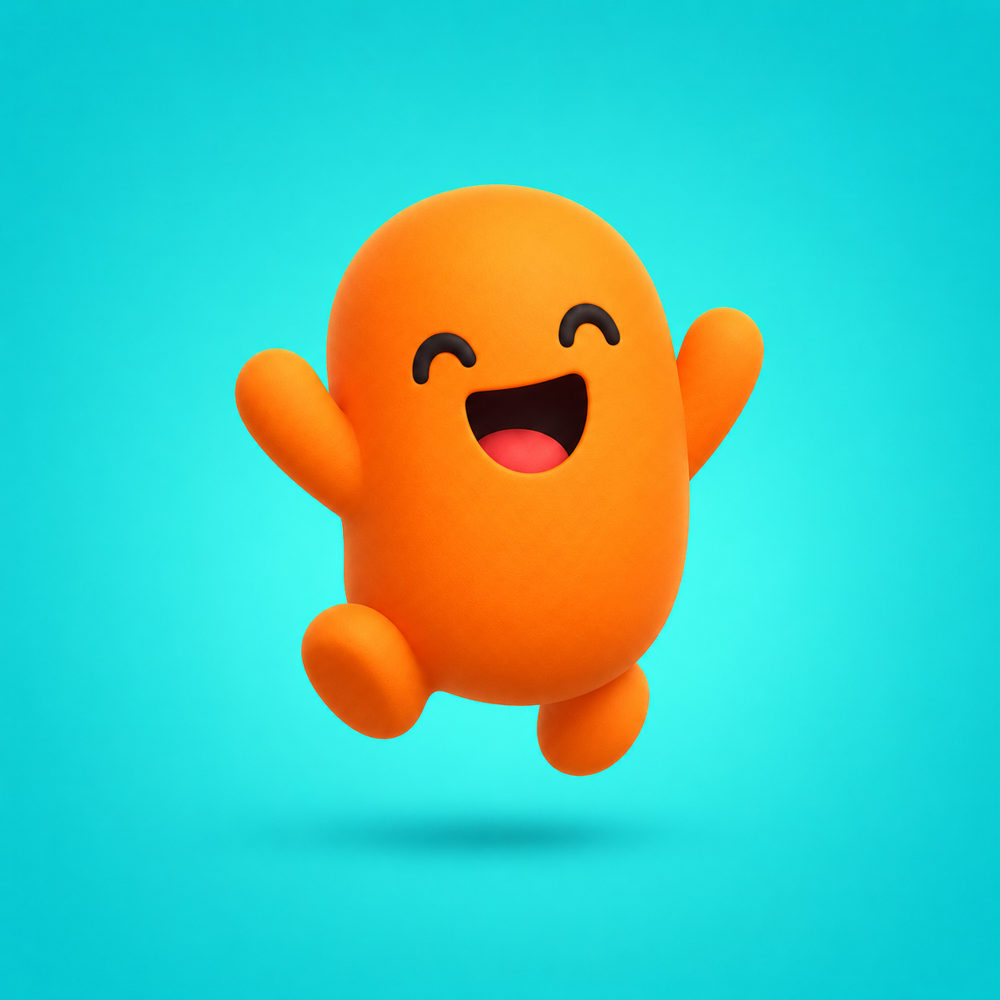
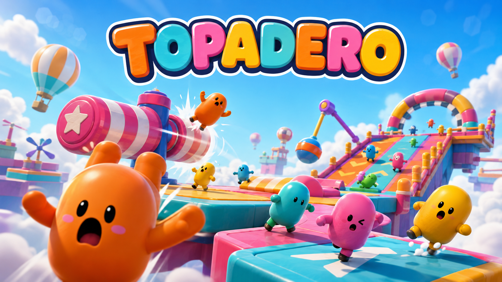

<div align="center">



# Topadero

*Un juego de plataformas de obstáculos en el navegador, al estilo Fall Guys, para una persona en local. Cada día, un circuito nuevo.*


[Jugar](https://dobbygl.github.io/topadero/play/) • [Web](https://dobbygl.github.io/topadero/) • [Código fuente](https://github.com/dobbygl/topadero) • [Características](#características) • [Puesta en marcha](#puesta-en-marcha) • [Arquitectura](#arquitectura)



</div>

Topadero es un juego de plataformas de obstáculos que corre en el navegador. Controlas un personaje cápsula en tercera persona, saltas desniveles y recorres el circuito del día hasta una meta cronometrada. Nació como prototipo para validar una hipótesis (que mover esa cápsula sobre un motor de físicas resulta divertido y responde bien) y, validada, ha crecido hacia un juego publicable: un circuito nuevo cada día, audio, un shell completo (título, pausa, resultados y ajustes) y mejor marca guardada en local. El cimiento sigue siendo el mismo: que mover la cápsula se sienta bien.

> [!TIP]
> El juego está implementado y publicado. La [web de presentación](https://dobbygl.github.io/topadero/) tiene el botón de jugar, o entra directo al [juego](https://dobbygl.github.io/topadero/play/) sin instalar nada.

## Características

- **Control en tercera persona** con cámara orbital que sigue al personaje de forma suave, sin saltos bruscos.
- **Físicas deterministas e independientes de la tasa de fotogramas**: el mismo input produce la misma trayectoria a 30 o a 144 FPS.
- **Salto solo apoyado**: nada de doble salto ni salto en el aire.
- **Pase de feel del control (Feature 003)**: el salto perdona errores de timing (*jump buffering* + *coyote time*) y su altura se modula con la pulsación (un toque salta poco, mantener salta más alto, con un mínimo garantizado); movimiento con peso (rampa de aceleración/frenado), control aéreo ajustable y gravedad asimétrica (caída más rápida, mejor sensación de salto). Todo se consume dentro del paso fijo, así que sigue siendo idéntico a 30 o 144 FPS.
- **Circuito con variedad de obstáculos**: plataformas, rampa y varios obstáculos móviles deterministas (vaivén, barra giratoria, péndulo, empujador) más una plataforma portante horizontal y un atajo arriesgado.
- **Cronómetro por intento** y estado de victoria con el tiempo al cruzar la meta.
- **Respawn al caer** en pocos segundos y **reinicio del intento** con una tecla, sin recargar la página.
- **Vestido gráfico (Feature 002)**: cielo con nubes, plataformas *candy* redondeadas y glossy con flechas, señalización, props de cielo (globos, molinillos), portal FINISH dorado y un **personaje animado** (idle / andar / correr / saltar).
- **Entrada y accesibilidad (Feature 004)**: además de teclado y ratón, se juega con **mando** (sticks + botón de salto) y en **móvil con controles táctiles** (joystick virtual, botón de salto, arrastre de cámara), con cambio de esquema automático. Reasignación de controles, sensibilidad e inversión de cámara y opciones de accesibilidad (*reduced motion*, HUD legible). El juego es **instalable como app (PWA)** y se juega sin conexión. Toda la entrada se consume dentro del paso fijo: el determinismo no cambia.
- **Audio (Feature 005)**: efectos de las acciones núcleo (salto, aterrizaje, golpe, meta, reaparición) y música de fondo en bucle sin corte, con volúmenes de música y efectos y silencio. Suena fuera del paso fijo: no toca el determinismo.
- **Circuito nuevo cada día (Feature 006)**: el trazado se genera de forma determinista cada día, el mismo para todo el mundo, reutilizando los obstáculos validados en disposiciones nuevas y garantizando que siempre se puede completar. Funciona también sin conexión (degradación offline) y guarda tu mejor marca del día en local.
- **Shell de juego (Feature 007)**: el juego es jugable de extremo a extremo desde la interfaz, sin consola ni flags: pantalla de título, pausa (reanudar, reiniciar, volver al título), pantalla de resultados con tu tiempo y tu mejor marca, y un panel de ajustes (volúmenes, sensibilidad, reasignación de controles) que se aplica en caliente y se recuerda entre sesiones. La pausa congela la simulación de forma determinista (no acumula tiempo ni dispara saltos colgados), implementada fuera del paso fijo para no tocar la puerta de determinismo.

La **colisión y la simulación** usan solo primitivas (cápsulas, cajas, cilindros). La **capa de render** sí lleva arte decorativo (excepción de la constitución v1.1.0 + v1.2.0): mallas low-poly y texturas alineadas a los colliders, **nunca** como geometría de colisión, y animación esqueletal conducida por el tiempo de render que no afecta a la física. Siguen fuera de alcance: multijugador o red entre jugadores y backend propio o ranking online; la persistencia es estrictamente local.

## Cómo se juega

| Acción | Tecla / entrada |
|---|---|
| Mover (relativo a la cámara) | `W` `A` `S` `D` o flechas |
| Saltar (solo apoyado; mantener = más alto) | `Espacio` |
| Orbitar la cámara | Ratón (clic en el canvas para capturar el puntero) |
| Reiniciar el intento | `R`, o el botón en el menú de pausa |
| Pausar / reanudar | `P` (o `Esc`); en móvil, salir de la app pausa sola |
| Debug de físicas (colliders) | `B`, el panel de ajustes, o `?debug` en la URL |

Arrancas desde la pantalla de título; el resto del flujo (jugar, pausar, ver el resultado, rejugar, ajustar) se hace desde la interfaz, sin tocar la consola.

> [!TIP]
> El cronómetro arranca con tu primer movimiento o salto, no al mover la cámara. Cae por un borde y reaparecerás en la salida sin perder la partida.

## Puesta en marcha

**Requisitos:** Node.js 22 (la versión usada en CI), npm y un navegador de escritorio con WebGL2 y WebAssembly.

```bash
git clone https://github.com/dobbygl/topadero.git
cd topadero
npm ci
npm run dev
```

Comandos disponibles:

| Comando | Propósito |
|---|---|
| `npm run dev` | Servidor de desarrollo de Vite |
| `npm test` | Pruebas con Vitest: determinismo, pausa, generador del circuito, audio y entrada |
| `npm run test:watch` | Vitest en modo interactivo |
| `npm run typecheck` | Validación estricta de TypeScript |
| `npm run build` | Typecheck y build de producción en `dist/` |
| `npm run preview` | Servir localmente el build |

La guía completa de ejecución y validación está en [`quickstart.md`](specs/001-obstacle-platformer/quickstart.md).

## Arquitectura

La línea divisoria que importa separa el **núcleo de simulación** del **render**:

- **`src/sim/`** es un núcleo *headless*: posee el mundo de Rapier, el controlador cinemático, el obstáculo y el estado del intento; no importa Three.js ni toca el DOM.
- **`src/core/gameLoop.ts`** convierte el reloj de render en pasos fijos de 60 Hz. También asigna cada flanco de teclado, capturado con timestamp, al paso de simulación correspondiente.
- **`src/render/`, `src/ui/`, `src/input/`, `src/audio/` y `src/settings/`** son vistas y adaptadores puros: dibujan el estado, interpolan transformaciones, reproducen audio, traducen teclado/ratón/mando/táctil a entrada del bucle y aplican las preferencias. El shell (título/pausa/resultados/ajustes) vive en `src/ui` y solo lee estado y emite intención.
- **`src/circuitgen/` y `src/daily/`** generan y resuelven el circuito del día fuera del paso fijo; `src/sim/` no los importa, así que la verificación de determinismo no cambia.
- **`src/circuit.ts`** es la fuente compartida de la geometría que utilizan física y render.
- **`src/config.ts`** concentra todos los parámetros de ajuste (velocidad, salto, umbral de caída, cámara…) en un único lugar.

```text
src/
├── main.ts            # Bootstrap: await RAPIER.init(), resuelve el circuito del día, arma todo y gobierna el shell
├── config.ts          # Único lugar de parámetros de ajuste
├── circuit.ts         # Tipos del circuito: geometría que comparten física y render
├── core/gameLoop.ts   # Paso fijo, ventanas temporales de input, interpolación y pausa (pauseShift)
├── sim/               # Núcleo headless: Rapier, jugador, obstáculos y estado del intento
├── circuitgen/        # Generador determinista del circuito del día (puro, headless)
├── daily/             # Circuito del día: resolución (red de solo lectura) + caché y mejor marca locales
├── input/             # Teclado, ratón, mando, táctil, pointer lock y preferencias
├── audio/             # Web Audio: efectos y música, fuera del paso fijo
├── settings/          # Preferencias de jugador (volúmenes + entrada): defaults de config, persistidas en local
├── render/            # Mallas Three.js, escena y cámara de seguimiento
└── ui/                # Vistas DOM: HUD, shell (título / pausa / resultados) y panel de ajustes
```

> [!IMPORTANT]
> Que el núcleo sea instanciable sin navegador permite verificar la regla no negociable del proyecto: `tests/determinism.test.ts` ejercita la simulación a 60 Hz, con jitter, a 30 Hz y a 144 Hz sobre los mismos inputs. Si falla, el despliegue se bloquea.

## Estado, pruebas y despliegue

El juego se construye con [Spec Kit](https://github.com/github/spec-kit), siguiendo el flujo constitución → especificación → clarificación → plan → tareas → implementación. El prototipo (Feature 001) cerró sus tres rebanadas:

- [x] **P1 — Control y sensación.** Movimiento, salto, cámara y colisiones estables.
- [x] **P2 — Circuito hasta la meta.** Plataformas, rampa, obstáculo móvil, cronómetro y victoria.
- [x] **P3 — Caída y reinicio.** Respawn y reinicio del intento sin recargar.

**Feature 002 — variedad de obstáculos + vestido gráfico** (constitución v1.2.0): implementada y *code-complete*, pendiente de prueba de juego manual. Añade 3 tipos nuevos de obstáculo determinista + plataformas portantes, identidad visual 2D, mallas low-poly y un personaje animado, **manteniendo el determinismo** (la puerta automática sigue en verde) y la **colisión sobre primitivas**. Documentos en [`specs/002-obstacle-variety-and-art/`](specs/002-obstacle-variety-and-art/).

**Feature 003 — pase de feel del control**: implementada y *code-complete*, pendiente de prueba de juego manual y afinado de cifras. Añade jump buffering, coyote afinado, salto de altura variable (con altura mínima garantizada), control aéreo, aceleración/desaceleración en suelo y gravedad asimétrica, **todo dentro del paso fijo**: la puerta de determinismo crece con casos de salto bufferizado, soltado-temprano-vs-mantenido (muestreo de pico) y rampa de locomoción, y sigue en verde a las 4 cadencias. Documentos en [`specs/003-control-feel-pass/`](specs/003-control-feel-pass/).

**Pivote a producto (constitución v2.0.0+).** Sobre ese control, cada incremento es una feature con su spec, plan y tareas:

- **004 — entrada y accesibilidad**: mando, táctil/móvil, reasignación, accesibilidad y app instalable (PWA). Documentos en [`specs/004-input-accessibility/`](specs/004-input-accessibility/).
- **005 — audio**: efectos de las acciones núcleo y música en bucle, con volúmenes. Documentos en [`specs/005-audio/`](specs/005-audio/).
- **006 — circuito nuevo cada día**: trazado generado de forma determinista cada día, el mismo para todo el mundo, con degradación offline y mejor marca local.
- **007 — shell de juego**: título, pausa, resultados y ajustes; jugable de extremo a extremo desde la interfaz, sin consola ni flags (Principio VI). La pausa congela la simulación fuera del paso fijo, así que la puerta de determinismo no cambia. Documentos en [`specs/007-game-shell/`](specs/007-game-shell/).

Cada push a `main` ejecuta en GitHub Actions:

```text
npm ci → npm test → npm run build → GitHub Pages
```

Un test o build fallido bloquea el despliegue. La CI ensambla un sitio combinado: la **web de marketing** (`marketing/landing/`) en la raíz y el **juego** bajo `/play/`. Vite usa `base: './'` para que el mismo artefacto funcione en desarrollo y bajo cualquier subruta de GitHub Pages.

El build actual incluye Rapier WASM embebido y genera un chunk principal grande (aprox. 2,9 MB sin comprimir). Es una mejora futura de carga, no un bloqueo funcional del juego.

## Documentación

| Documento | Descripción |
|---|---|
| [Constitución](.specify/memory/constitution.md) | Principios y gobernanza |
| [Especificación](specs/001-obstacle-platformer/spec.md) | Historias, requisitos y criterios de éxito |
| [Plan](specs/001-obstacle-platformer/plan.md) | Arquitectura prevista y estado final |
| [Tareas](specs/001-obstacle-platformer/tasks.md) | Registro de implementación completado |
| [Quickstart](specs/001-obstacle-platformer/quickstart.md) | Ejecución y checklist de regresión |
| [Contratos](specs/001-obstacle-platformer/contracts/) | Fronteras actuales de simulación y controles |
| [Feature 002](specs/002-obstacle-variety-and-art/) | Variedad de obstáculos + vestido gráfico: spec, plan, tareas y contratos |
| [Feature 007](specs/007-game-shell/) | Shell de juego (título, pausa, resultados, ajustes): spec, plan, tareas y contratos |
